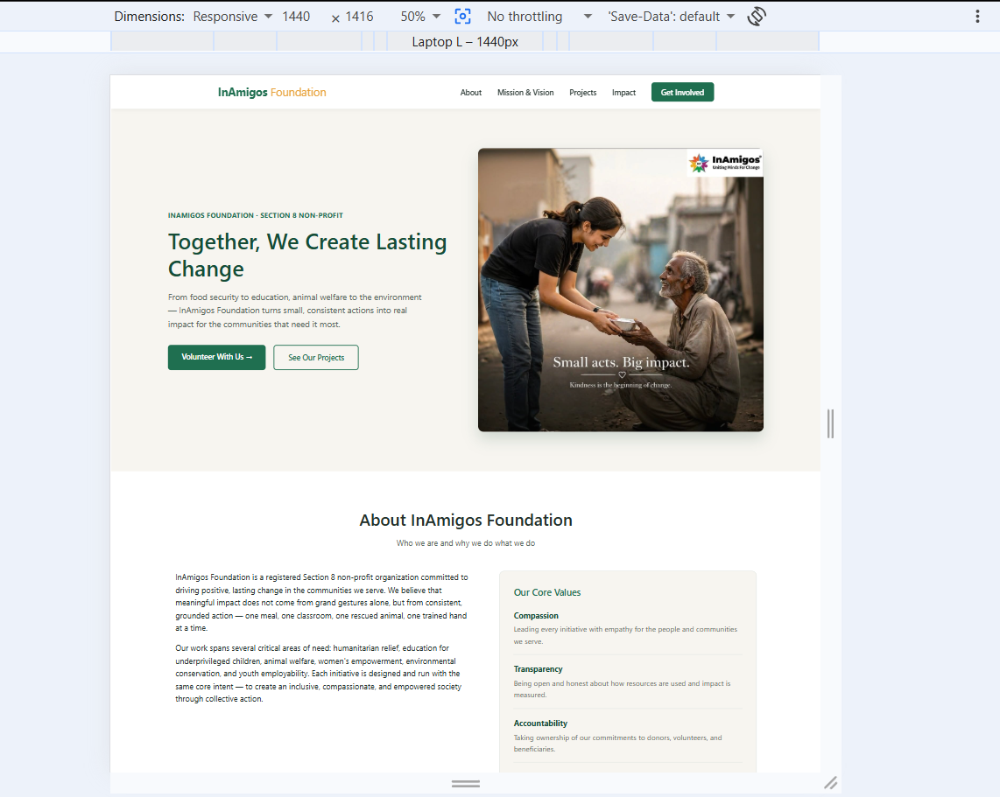
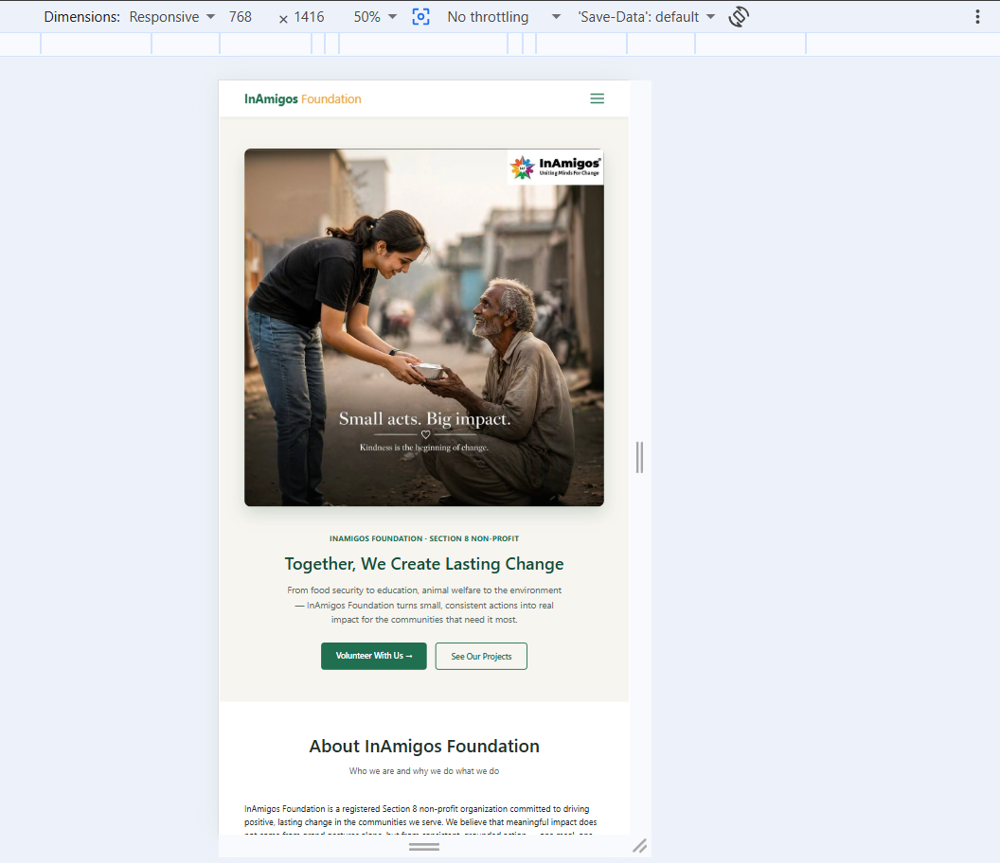
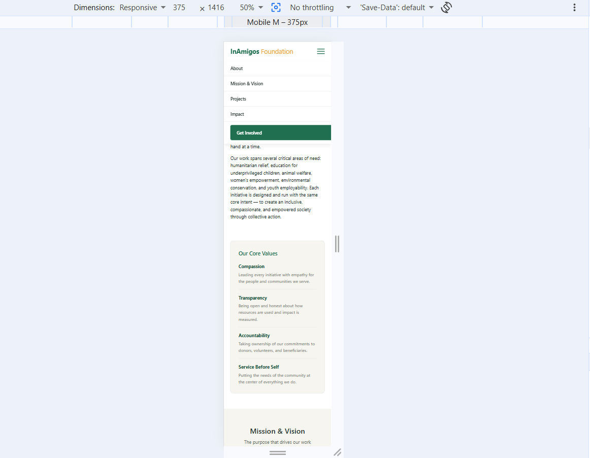

# 🤝 InAmigos Foundation — NGO Awareness Webpage


> A responsive NGO awareness webpage for **InAmigos Foundation**, built with pure HTML5 & CSS3 — no JavaScript, no frameworks. Developed as Task 1 of a Web Development internship.

---

## 🔗 Live Demo

**Live Demo:** [aryanrawat00.github.io/git-commit--Task-1-InAmigos-Foundation-NGO-awareness-webpage](https://aryanrawat00.github.io/git-commit--Task-1-InAmigos-Foundation-NGO-awareness-webpage/)

---

## 📖 About

InAmigos Foundation is a Section 8 non-profit working across food security, education, animal welfare, women's empowerment, environmental action, and youth skill development. This page introduces the foundation, its mission and vision, and its six ongoing projects — built to raise awareness and encourage volunteers and support.

## ✨ Sections

- Sticky navigation
- Hero section
- About & Core Values
- Mission & Vision
- Ongoing Projects — Seva, Bachpanshala, Jeev, Udaan, Prakriti, Vikas
- Social Impact statistics
- Call-to-Action (Volunteer / Support)
- Footer with official NGO links

## 🛠️ Built With

- HTML5 — semantic markup
- CSS3 — Flexbox, Grid, media queries
- Zero JavaScript, zero frameworks

## 📁 Project Structure

```
├── index.html
├── style.css
├── images/
│   ├── hero.jpg
│   ├── project-seva.jpg
│   ├── project-bachpanshala.jpg
│   ├── project-jeev.jpg
│   ├── project-udaan.jpg
│   ├── project-prakriti.jpg
│   └── project-vikas.jpg
└── screenshots/
    ├── desktop.png
    ├── tablet.png
    └── mobile.png
```

## 📸 Screenshots

**Desktop**


**Tablet**


**Mobile**


## 🙏 Credits

Built as an internship project to spread awareness about InAmigos Foundation's work. All NGO information, branding, and photos belong to **InAmigos Foundation** — [official website](https://inamigosfoundation.org.in/) · [Instagram](https://www.instagram.com/inamigos/). This repository is a student project, not an official Foundation property.
